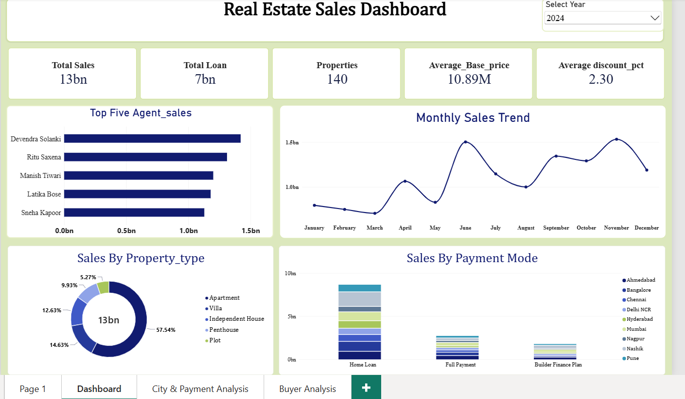

# Anand Bhujbal — Data Analyst Portfolio Website

A personal portfolio website for **Anand Bhujbal**, Data Analyst at Greateway Software Pvt. Ltd. (Pune, Maharashtra), showcasing real-world projects, executive Power BI dashboards, MySQL relational schemas, and advanced analytical queries.



---

## 🌟 Highlights

- **Design System**: Warm minimalist design inspired by modern Dribbble UI with peach/coral ambient radial glow, geometric typography ([Plus Jakarta Sans](https://fonts.google.com/specimen/Plus+Jakarta+Sans)), and serif accents ([Playfair Display](https://fonts.google.com/specimen/Playfair+Display)).
- **Dual Themes**: Complete light and dark mode with localStorage persistence.
- **Interactive Dashboard Viewer**: Tabbed browser mockup showcasing multi-page Power BI reports (Sales Overview, City & Payment Analysis, and Buyer Details).
- **SQL Analytics Lab**: Integrated query explorer showcasing production SQL scripts (Window functions, CTEs, YoY growth calculations, customer tier segmentation, and reusable reporting views) with 1-click clipboard copy.
- **Full-Screen Lightbox**: High-resolution zoomable inspection for all project dashboard screenshots.
- **Verified Achievements**: Direct PDF resume download, interactive career timeline, and responsive contact form.

---

## 🛠️ Tech Stack & Skills

- **Frontend**: HTML5, Vanilla CSS3 (Custom Design Tokens, Flexbox, CSS Grid), Vanilla JavaScript (ES6+, IntersectionObserver, ScrollSpy).
- **Data Analytics & BI**: Microsoft Power BI Desktop, DAX KPIs, Advanced Microsoft Excel (Pivot tables, VLOOKUP, Power Query).
- **Databases & SQL**: MySQL 8.0, Relational Schema Architecture, Indexing, Normalization, Window Functions (`RANK`, `ROW_NUMBER`, `LAG`), CTEs, Aggregations.
- **Programming & Analysis**: Python (Pandas, NumPy, Matplotlib, Seaborn, Scikit-learn).

---

## 📂 Project Structure

```
Portfolio/
├── assets/
│   ├── anand-photo.jpg                 # Portrait photo
│   ├── Anand_Bhujbal_Resume.pdf        # Verified PDF resume for download
│   └── dashboards/
│       ├── sales-overview.png          # Real Estate Sales Overview
│       ├── city-payment-analysis.png   # City & Payment Analysis (₹28B)
│       ├── buyer-analysis.png          # Buyer & Loan Distribution
│       └── urbanmart-dashboard.jpg     # UrbanMart Retail Intelligence
├── Sql Scripts/
│   ├── Database_Tables_.sql            # Schema creation & table definitions
│   ├── business_insight_query.sql      # CTEs, Window functions & Business queries
│   └── exploratory_Analysis_Real_estate.sql # EDA & data quality checks
├── index.html                          # Main single-page portfolio
├── styles.css                          # Custom responsive CSS design system
├── script.js                           # Interactive JavaScript features
├── README.md                           # Documentation
└── .gitignore                          # Git ignore configuration
```

---

## 🚀 Running Locally

You can run this project locally using Python's built-in HTTP server:

```bash
# Start server in the project folder
python -m http.server 8080
```

Then open your browser and navigate to:
```
http://localhost:8080/index.html
```

---

## 📬 Contact & Links

- **Email**: [anandbhujbal35@gmail.com](mailto:anandbhujbal35@gmail.com)
- **LinkedIn**: [linkedin.com/in/anandbhujbal](https://linkedin.com/in/anandbhujbal)
- **Location**: Pune / Ahilyanagar, Maharashtra, India

© 2026 Anand Bhujbal. Built with precision for impact.
